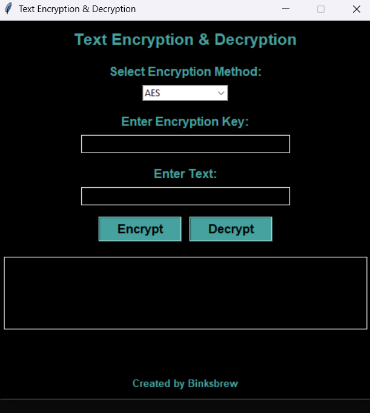

## Custom Key Encryption & Decryption
A **Python-based GUI application** for text encryption and decryption using a **custom user-defined key**. The application uses the **Fernet (AES-128 CBC with HMAC) encryption algorithm** from the **cryptography** library.
=======
# **🔐 Custom Text Encryption & Decryption**
A **Python-based GUI application** for **text encryption and decryption** using user-selected encryption algorithms (**AES, DES, RSA, and Fernet**). The application allows users to enter a **custom encryption key**, ensuring secure and reliable encryption.

---

## **📌 Features**
✅ **Supports Multiple Encryption Algorithms** (AES, DES, RSA, and Fernet)  
✅ **User-defined encryption key** (AES, DES, and Fernet)  
✅ **RSA key pair generation** (for RSA encryption)  
✅ **Secure AES-128 & DES encryption**  
✅ **Graphical User Interface (GUI) using Tkinter**  
✅ **Dark Mode UI with `#45a29e` theme**  
✅ **Cursor highlight and button hover effects**  
✅ **Error handling for incorrect keys**  

---

## **📥 Installation & Setup**
### **1️⃣ Check Python Version**
Ensure you have **Python 3.8 or later** installed:
```sh
python --version
```

### **2️⃣ Install Dependencies**
Run the following command to install required libraries:
```sh
pip install -r requirements.txt
```
Or manually install them:
```sh
pip install cryptography pycryptodome
```

### **3️⃣ Verify Installed Packages**
Check installed dependencies:
```sh
pip freeze
```
Expected output:
```
cffi==1.15.1
cryptography==44.0.1
pycparser==2.21
pycryptodome==3.21.0
```

### **4️⃣ Run the Application**
Navigate to the project folder and execute:
```sh
python main.py
```

---

## **🛠 How It Works**
1. **Select an Encryption Algorithm**  
   - Choose **AES, DES, RSA, or Fernet** from the dropdown menu.
2. **Enter Encryption Key (AES, DES, Fernet)**  
   - For **AES, DES, and Fernet**, enter a **custom encryption key**.  
   - For **RSA**, the application **generates public and private keys automatically**.
3. **Enter Text to Encrypt**  
   - Click **"Encrypt"**, and the text is encrypted using the selected algorithm.
4. **Decryption Process**  
   - Paste the **encrypted text** into the input field.  
   - Enter the **same key** (for AES, DES, and Fernet).  
   - Click **"Decrypt"**, and the original text is recovered.

---

## **🔑 Supported Encryption Algorithms**
| Algorithm | Description |
|-----------|------------|
| **AES (Advanced Encryption Standard)** | Uses AES-128 in **ECB mode** with **SHA-256-derived keys**. |
| **DES (Data Encryption Standard)** | Uses **ECB mode** with an **8-byte key** derived from MD5 hashing. |
| **RSA (Rivest-Shamir-Adleman)** | Generates **public and private key pairs** for encryption & decryption. |
| **Fernet (AES-128 with HMAC)** | Uses **AES-128 in CBC mode** with **HMAC authentication**. |

---

## **📂 Project Structure**
```
/Text-Encryption
│── main.py          # Main application file
│── README.md        # Project documentation
│── requirements.txt # List of dependencies
│── private.pem      # RSA private key (generated)
│── public.pem       # RSA public key (generated)
```

---

## **🎨 UI Preview**



---

<<<<<<< HEAD
## **Screenshots**


---

## **License**
This project is open-source and free to use. 🚀

=======
## **🔒 Security Notes**
- AES, DES, and Fernet require a **user-defined encryption key**.
- RSA encryption **automatically generates public and private keys**.
- **Keys must be stored securely**, especially for RSA encryption.
- **DO NOT share private keys** with others.

---

## **📜 License**
This project is **open-source** and free to use. 🚀

---

## **💡 Future Enhancements**
🔹 Add **CBC mode for AES and DES**  
🔹 Allow **password-based key derivation** for stronger security  
🔹 Implement **SHA-512 hashing** for better key derivation  

---

### **🎯 Contributors**
Developed by **Binksbrew**. If you’d like to contribute, feel free to fork this repo and submit a pull request! 🚀

>>>>>>> 43e11e0 (updated with more algorithms)
